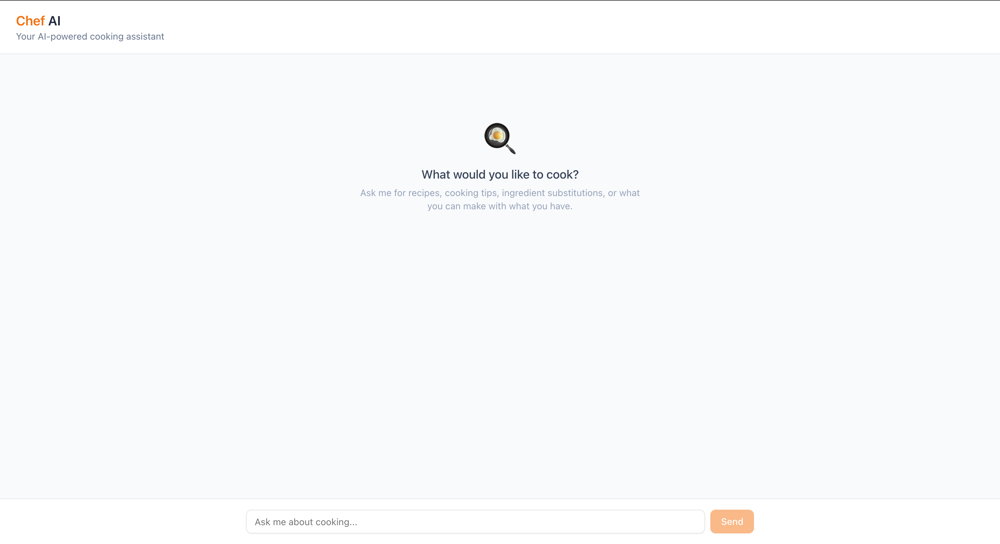
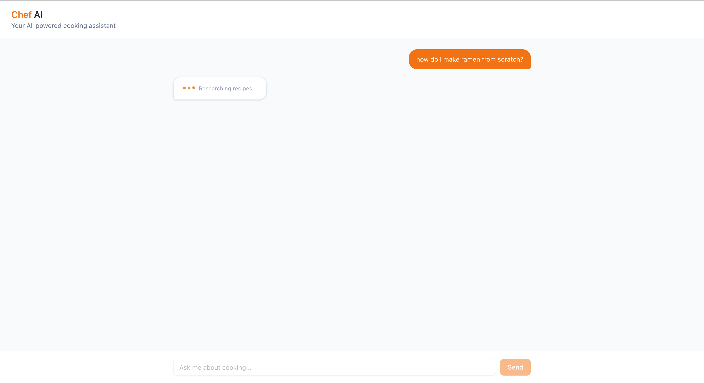
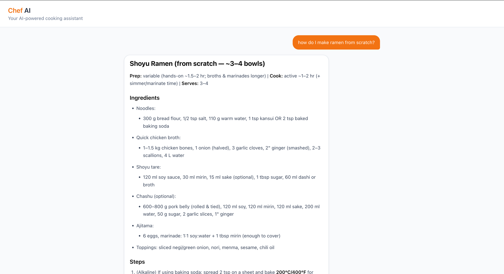

# Chef AI — LLM-Powered Cooking & Recipe Q&A

A full-stack AI cooking assistant built with **FastAPI + LangGraph** (backend) and **Next.js 16** (frontend). Ask it about recipes, cooking techniques, or ingredients — it'll research, check your available cookware, and give you a tailored response.

### Home


### Searching


### Output


---

## Architecture

```
User ──► Next.js Chat UI ──► FastAPI ──► LangGraph Pipeline
                                                  │
                                                START
                                                  │
                                                  ▼
                                           classify_query
                                             │        │
                                      (off-topic)  (cooking-related)
                                             │        │
                                             ▼        ▼
                                     refuse_response  research_agent ◄──► web search (Tavily/DDG)
                                             │        │
                                             ▼        ▼
                                            END    cookware_check
                                                      │
                                                      ▼
                                                generate_response
                                                      │
                                                      ▼
                                                     END
```

**LangGraph Flow (5 nodes):**
1. **classify_query** — Determines if the query is cooking-related (structured output, temp=0.0)
2. **research_agent** — Researches the query, optionally using web search (Tavily/DuckDuckGo)
3. **cookware_check** — Validates the recipe against the user's available cookware
4. **generate_response** — Synthesizes a final, formatted response
5. **refuse_response** — Polite refusal for off-topic queries (deterministic, no LLM call)

---

## Local Setup (Development)

### Prerequisites
- Python 3.12+
- Node.js 20+
- [bun](https://bun.sh) (or pnpm as alternative)
- OpenAI API key

### Backend

```bash
cd backend
python3 -m venv venv
source venv/bin/activate
pip install -r requirements.txt

# Configure environment
cp .env.example .env
# Edit .env with your OPENAI_API_KEY (required) and TAVILY_API_KEY (optional)

# Run
uvicorn main:app --reload --reload-exclude venv
```

Server runs at http://localhost:8000

### Frontend

```bash
cd frontend
bun install          # or: pnpm install
cp .env.example .env.local

bun run dev          # or: pnpm dev
```

App runs at http://localhost:3000

---

## Docker Setup

```bash
# Create backend/.env with your API keys first
docker-compose up --build
```

- Backend: http://localhost:8000
- Frontend: http://localhost:3000

---

## API Examples

### Health Check
```bash
curl http://localhost:8000/api/health
```

### Cooking Query (sync)
```bash
curl -X POST http://localhost:8000/api/chat/sync \
  -H "Content-Type: application/json" \
  -d '{"messages": [{"role": "user", "content": "How do I make scrambled eggs?"}]}'
```

### Off-Topic Query (should be refused)
```bash
curl -X POST http://localhost:8000/api/chat/sync \
  -H "Content-Type: application/json" \
  -d '{"messages": [{"role": "user", "content": "What is the capital of France?"}]}'
```

### With Debug Info
```bash
curl -X POST http://localhost:8000/api/chat/sync \
  -H "Content-Type: application/json" \
  -d '{"messages": [{"role": "user", "content": "How do I make pasta?"}], "debug": true}'
```

### Streaming (SSE)
```bash
curl -N -X POST http://localhost:8000/api/chat \
  -H "Content-Type: application/json" \
  -d '{"messages": [{"role": "user", "content": "How do I make pasta?"}]}'
```

### Multi-turn Conversation
```bash
curl -X POST http://localhost:8000/api/chat/sync \
  -H "Content-Type: application/json" \
  -d '{
    "messages": [
      {"role": "user", "content": "How do I make scrambled eggs?"},
      {"role": "assistant", "content": "Here is a recipe for scrambled eggs..."},
      {"role": "user", "content": "Can I add cheese to that?"}
    ]
  }'
```

---

## Environment Variables

### Backend (`backend/.env`)
| Variable | Required | Default | Description |
|----------|----------|---------|-------------|
| `OPENAI_API_KEY` | Yes | — | OpenAI API key for GPT-5-mini |
| `TAVILY_API_KEY` | No | — | Tavily search API key (falls back to DuckDuckGo) |
| `MODEL_NAME` | No | `gpt-5-mini` | LLM model name |
| `LOG_LEVEL` | No | `INFO` | Python logging level |

### Frontend (`frontend/.env.local`)
| Variable | Required | Default | Description |
|----------|----------|---------|-------------|
| `NEXT_PUBLIC_API_URL` | No | `http://localhost:8000` | Backend API URL |

---

## Hardcoded Cookware List

The system validates recipes against this cookware:
- Spatula, Frying Pan, Little Pot, Stovetop, Whisk, Knife, Ladle, Spoon

The LLM-based cookware check handles synonyms (e.g., "skillet" = "frying pan") and suggests substitutions when possible.

---

## Design Decisions

| Decision | Choice | Why |
|----------|--------|-----|
| LLM Model | `gpt-5-mini` | Fast, cheap, sufficient for cooking Q&A |
| Multi-node graph vs ReAct agent | 5 separate nodes | Visibility into each step, testability, meets spec requirement for node-based flow |
| Frontend SSE approach | Raw `fetch` + `ReadableStream` | Fewer dependencies, demonstrates understanding of streaming pattern. Aware of `@langchain/langgraph-sdk` and CopilotKit but chose simplicity |
| State management | Stateless backend (frontend sends full history) | Simpler, more scalable, no DB needed |
| Search tool | Tavily (primary) + DuckDuckGo (fallback) | Tavily has first-class LangChain integration; DDG needs no API key |
| `refuse_response` | Deterministic (no LLM call) | Saves latency and API cost; behavior is predictable |
| Separate `generate_response` node | Distinct from `research_agent` | Clean separation of concerns, spec compliance |
| Package manager | bun | Spec recommends it; fast install and dev server |

---

## AWS Deployment Plan

If I were deploying this to production, I'd go with **ECS Fargate** since we already have Dockerfiles and a compose setup — it's a pretty natural progression. Fargate lets me run the containers without managing EC2 instances, which removes a lot of operational overhead. I considered the other options but ruled them out:

- **EKS** — way too much complexity for two services. Kubernetes makes sense at scale, not here.
- **Lambda** — doesn't play well with SSE streaming since Lambda has hard timeout limits and we need long-lived connections for the chat endpoint.
- **Raw EC2** — means I'm patching OS, managing instances, setting up auto scaling groups manually. Not worth it.

### Architecture

I'd run two ECS services — one for the FastAPI backend, one for the Next.js frontend — each with their own task definition and CPU/memory limits. Container images get pushed to **ECR**.

Both services sit in a **VPC with private subnets**. An **Application Load Balancer** in public subnets handles routing: `/api/*` goes to the backend, everything else goes to the frontend. The ALB also handles TLS termination with an ACM certificate so I don't deal with certs at the application level.

### Scaling

**ECS Service Auto Scaling** on both services, using target tracking on CPU at around 70%. For the backend I'd also consider scaling on request count — LLM calls are mostly I/O-bound (waiting on OpenAI), so CPU might not spike even when the service is under heavy load.

### Secret Management

**AWS Secrets Manager** for `OPENAI_API_KEY` and `TAVILY_API_KEY`. ECS task definitions can reference Secrets Manager ARNs directly, so the keys get injected as environment variables at runtime without ever touching the image or plaintext config. I'd pick Secrets Manager over SSM Parameter Store here because it supports automatic key rotation, which matters for API keys. Non-sensitive config like `LOG_LEVEL` or `MODEL_NAME` can live in SSM Parameter Store since it's cheaper.

### Observability

- **Logging**: Swap the dev log formatter for `python-json-logger` in production so logs are structured JSON. CloudWatch Logs picks these up automatically from ECS containers.
- **Metrics**: Enable CloudWatch Container Insights for CPU/memory/network metrics per service.
- **Tracing**: Instrument with OpenTelemetry — LangChain already has OTEL integration, so I'd get spans for each LangGraph node and LLM call out of the box. Export traces to AWS X-Ray via the OTEL collector.
- **Alerts**: CloudWatch Alarms on error rate, p95 latency, and LLM API error counts.

---

## Auth & Security Plan

### Authentication

For an MVP, I'd start with **API key authentication** — clients send an `X-API-Key` header, the backend validates against a hashed value stored in Secrets Manager. This is dead simple to implement as FastAPI middleware and works fine for internal or limited-access use.

For a real production version, I'd move to **JWT with OAuth2**. Something like AWS Cognito or Auth0 as the identity provider — the Next.js frontend handles the OAuth login flow, gets a JWT, and passes it as a Bearer token on every request to FastAPI. FastAPI validates the signature and claims. This also gives us user identity, which we'd need anyway if we're tracking per-user recipe data for the ELT pipeline.

### CORS

Lock down FastAPI's `CORSMiddleware` to only allow the frontend's origin (the ALB domain or custom domain). In dev I allow `localhost:3000`, but `allow_origins=["*"]` should never be in production.

### Rate Limiting

Two layers:

1. **ALB / API Gateway level** — baseline request-per-IP limit to catch abuse early.
2. **Application level** — use `slowapi` (FastAPI rate-limiting library) for per-user limits on the chat endpoint specifically, since every request costs real money in LLM API calls. Something like 20 requests/minute per user feels reasonable as a starting point.

### Input Validation & Prompt Injection

Pydantic handles structural validation already (message format, field types, etc.). On top of that:

- **Max input length** — enforce a 2000 character limit on user messages. No one needs a longer cooking question.
- **LangGraph as a filter** — the `classify_query` node acts as a natural first line of defense since it determines whether a query is even cooking-related before it hits the main agent.
- **System prompt guardrails** — the cooking agent's system prompt is scoped tightly to its role, which helps resist injection attempts.
- For a production system, I'd add a dedicated prompt injection detection layer — libraries like `rebuff` or a fine-tuned small classifier that screens inputs before they reach the LLM.

### Safeguarding API Keys

The main principle: keys never appear in client-side code, Git history, Docker images, or logs.

- All LLM and tool calls go through the backend — the frontend never talks to OpenAI or Tavily directly.
- Keys live in Secrets Manager and are injected at runtime via ECS task definitions.
- `.gitignore` and `.dockerignore` both exclude `.env` files.
- `.env.example` files have placeholder values so anyone cloning the repo knows what's needed without seeing real keys.

---

## ELT Integration Plan (Bonus)

### Goal
Track which recipes users are making to give stakeholders a dashboard of cooking trends.

### Extract
- When users confirm a recipe (e.g., "I'll make this!"), log a structured event to **Amazon SQS** (or Kafka for higher throughput):
  ```json
  {
    "user_id": "abc123",
    "recipe_name": "Scrambled Eggs",
    "cuisine": "American",
    "cookware_used": ["Frying Pan", "Spatula"],
    "timestamp": "2024-01-15T10:30:00Z"
  }
  ```

### Load
- SQS → **AWS Lambda** consumer → **Amazon Redshift** (or Snowflake/BigQuery)
- Raw events land in a `raw_recipe_events` table
- Alternatively: Firehose → S3 → Redshift Spectrum for cost-effective querying

### Transform
- **dbt** models to aggregate:
  - Recipes by cuisine type (daily/weekly)
  - Most popular ingredients
  - Cookware usage frequency
  - Time-of-day cooking patterns
  - Recipe complexity distribution

### Serve
- **Metabase** or **Looker** dashboard connected to Redshift
- Key metrics: top 10 recipes this week, ingredient trends, cookware gaps
- Stakeholders get a "What are people cooking?" view at a glance

---

## Edge Cases & Future Work

| Edge Case | Current Behavior | Future Fix |
|-----------|-----------------|------------|
| Multi-step recipes with unavailable cookware | Suggests substitutions via LLM | Could break recipe into sub-steps and flag each |
| Ambiguous ingredient names ("tomato sauce" vs "strained tomatoes") | LLM handles with best guess | Ask clarifying questions before proceeding |
| Non-English queries | LLM handles common languages reasonably | Detect language, add unit conversion (metric/imperial) |
| Long conversations hitting context limits | Sends full history each request | Implement conversation summarization or sliding window |
| Tool failures (search outages) | Logs error, continues without search results | Retry with exponential backoff, circuit breaker pattern |
| Prompt injection attempts | Classification node filters off-topic | Dedicated guardrail layer, input sanitization |
| Specialized techniques (sous vide, fermentation) | Handled by LLM knowledge + search | Flag as advanced, note specialized equipment needs |
| Concurrent requests | Stateless, each request independent | Add rate limiting, request queuing |

---

## Project Structure

```
.
├── backend/
│   ├── main.py                 # FastAPI entry point, CORS, routes
│   ├── config.py               # Env vars, cookware list, model config
│   ├── graphs/
│   │   └── cooking_graph.py    # LangGraph definition and wiring
│   ├── nodes/
│   │   ├── classify.py         # Query classification (structured output)
│   │   ├── research.py         # Research agent with tool binding
│   │   ├── cookware.py         # Cookware feasibility check
│   │   ├── generate.py         # Final response synthesis
│   │   └── refuse.py           # Off-topic refusal (deterministic)
│   ├── tools/
│   │   └── search.py           # Tavily/DuckDuckGo search tool
│   ├── prompts/                # Versioned prompt templates
│   ├── schemas/                # Pydantic request/response/state models
│   ├── requirements.txt
│   ├── Dockerfile
│   └── ruff.toml
├── frontend/
│   ├── app/                    # Next.js App Router pages
│   ├── components/chat/        # Chat UI components
│   ├── hooks/useChat.ts        # Custom hook with useReducer
│   ├── lib/
│   │   ├── api.ts              # Fetch functions (sync + streaming)
│   │   └── types.ts            # Zod schemas + TypeScript types
│   ├── Dockerfile
│   └── package.json
├── docker-compose.yml
├── Makefile
├── docs/
│   ├── DESIGN_DECISIONS.md
│   ├── SPEC.md
│   ├── home.png
│   ├── searching.png
│   └── output.png
└── README.md
```

---

## AI Tooling Used

- **Claude Code (Opus 4.6)** — Used for scaffolding, implementation, and documentation. All code was generated with AI assistance and reviewed for correctness.
- **GPT-5-mini** — Runtime LLM for the cooking assistant (classification, research, cookware check, response generation).
- **Tavily** — Web search tool integrated via LangChain for recipe research.

---

## Timeboxing Notes

Built in phases:
1. **Backend scaffolding** — Config, schemas, prompts, bare FastAPI server
2. **LangGraph core** — All 5 nodes, graph wiring, sync + streaming endpoints
3. **Frontend** — Next.js 16 with shadcn/ui chat interface, SSE streaming
4. **Docker + docs** — Dockerfiles, docker-compose, this README

### Trade-offs Made
- **No unit tests** — Prioritized working E2E over test coverage. Would add pytest for graph nodes and Jest for frontend hooks.
- **No CI/CD pipeline** — Would add GitHub Actions with lint, test, build stages.
- **Plain-text logging** — Production would use structured JSON logging with request IDs.
- **No conversation persistence** — Stateless by design; would add Redis or PostgreSQL for production.

## Potential feature
 - Agent that searches for and adds all necessary ingredients into a shopping cart (Amazon, HEB, Instacart, etc)